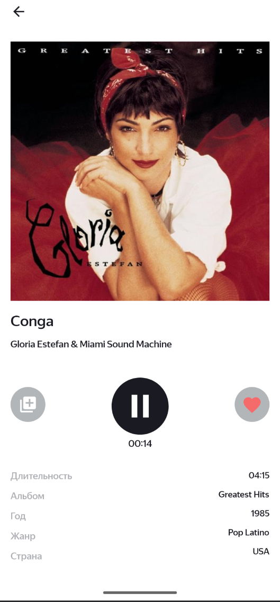

# Playlist Maker

Android-приложение для поиска музыки, прослушивания превью, сохранения любимых треков и создания собственных плейлистов.

## Возможности

- поиск треков и сохранение истории поиска;
- просмотр информации о треке: длительность, альбом, год, жанр и страна;
- воспроизведение музыкального превью;
- добавление треков в избранное;
- создание собственных плейлистов;
- добавление и удаление треков из плейлистов;
- редактирование и удаление плейлистов;
- возможность поделиться плейлистом;
- светлая и тёмная темы;
- экран настроек с возможностью поделиться приложением, написать в поддержку и открыть пользовательское соглашение.

## Стек

- **Retrofit + Gson** — сетевой слой
- **Room** — локальное хранение данных
- **Koin** — dependency injection
- **Glide** — загрузка изображений
- **Navigation Component** — навигация
- **ViewBinding**
- **Jetpack Compose**
- **Foreground Service** — воспроизведение музыки

## Требования

- Android 10 (API 29)
